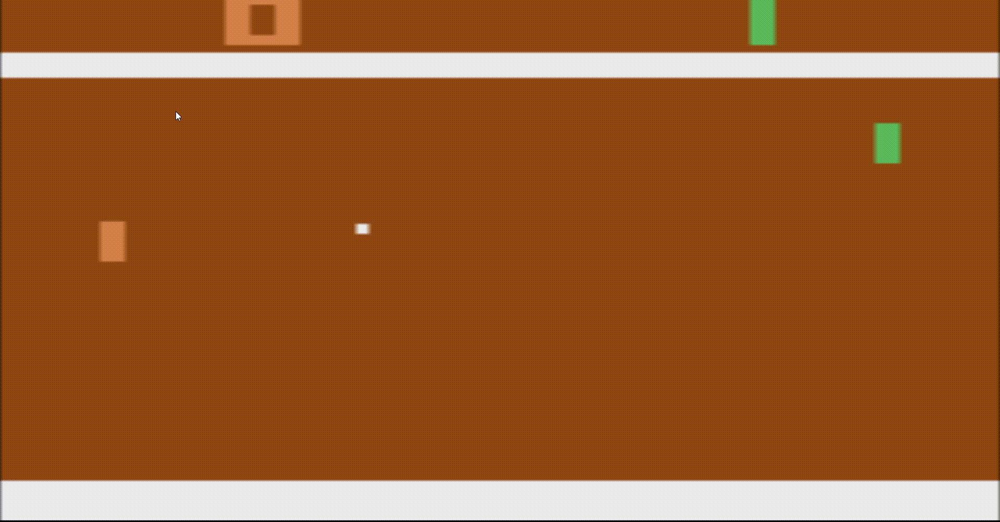

# Q Learning Pong AI

## Setup: 
The environments and technologies used: 
1. Q Learning Algorithm
2. PyTorch 
3. OpenAI Gym
4. Google VM

## Description: 
This repository contains the development of a Deep Q Learning AI that is trained
over a neural network using Google servers. I was tasked to understand the Q-
Learning Algorithm and apply it to a model to compete against other pretrained
models. Through the implementation, I used reinforcement learning to teach a
model how to play and win Pong. The bot was trained for over 10 hours and
1,000,000+ game frames to maximize win rates. 

## Training Results 

The scatter plot above shows the increase of average reward per 100k frames it was trained for. There is a positive linear increase as the model trains. 

The plot above shows the training losses per 100k frames it was trained for. 

